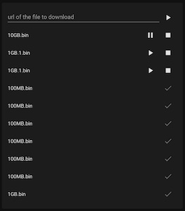

[](https://github.com/deblockt/aria2-card/releases/latest)
[](https://github.com/hacs/integration)


# Aria2 card

> Aria2 card for [Home Assistant](https://www.home-assistant.io/) Lovelace UI



## Installing

This card work only when the integration [aria2-integration](https://github.com/deblockt/hass-aria2) in installed.

You can use [HACS](https://hacs.xyz/) to install this component. Search for the Integration "Aria2 card".

If you don't have hacs installed, download the file `aria2-card.js` from [this page](https://github.com/deblockt/aria2-card/releases) at copy it on your `configuration/www/` directory. Reload your home assistant frontend.

You can now add the card on your lovelace ui using `custom card` and with the yaml

``` yaml
type: custom:aria2-card
```

## Configuration

There are no configuration available for this card.

By default, only 10 downloads are displayed by the card.

# Limitation

For now only admin user can use this card to get the list of downloads
